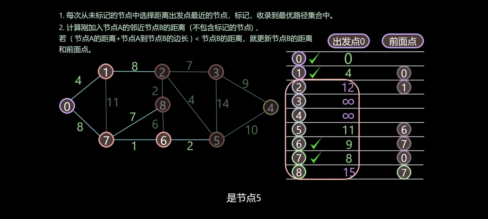

# Question

    priority_queue<pair<int, State>, vector<pair<int, State>>, greater<pair<int, State>>> pq;

    unordered_map<State, int, StateHash, StateEqual> dist;

    unordered_map<State, State, StateHash, StateEqual> prev;

# Answer



当然，下面是对这段代码中定义的每个数据结构的详细解释，包括它们的作用和用途：

### 1. `priority_queue<pair<int, State>, vector<pair<int, State>>, greater<pair<int, State>>> pq;`
```cpp
priority_queue<pair<int, State>, vector<pair<int, State>>, greater<pair<int, State>>> pq;
```
- **解释**: 这里定义了一个优先队列 `pq`，用于实现Dijkstra算法。
- **作用**: 优先队列用于存储路径成本和当前状态（站点和线路索引），并按路径成本从小到大排序。
- **具体类型**:
  - `pair<int, State>`: 每个元素是一个 `pair`，其中 `int` 表示路径成本，`State` 表示当前状态（站点和线路索引）。
  - `vector<pair<int, State>>`: 优先队列的底层存储容器是一个 `vector`，存储所有路径成本和状态对。
  - `greater<pair<int, State>>`: 比较函数，使得优先队列按路径成本从小到大排序。默认情况下，`priority_queue` 是按从大到小排序的，因此需要使用 `greater` 来改变排序方式。

### 2. `unordered_map<State, int, StateHash, StateEqual> dist;`
```cpp
unordered_map<State, int, StateHash, StateEqual> dist;
```
- **解释**: 这里定义了一个无序映射 `dist`，用于存储从起点到达每个状态的最小路径成本。
- **作用**: 用于记录从起点到每个站点在每条线路上的最短路径成本。
- **具体类型**:
  - `State`: 键，表示当前状态（站点和线路索引）。
  - `int`: 值，表示从起点到达该状态的最小路径成本。
  - `StateHash`: 自定义哈希函数，用于计算 `State` 对象的哈希值。
  - `StateEqual`: 自定义相等比较函数，用于比较两个 `State` 对象是否相等。

### 3. `unordered_map<State, State, StateHash, StateEqual> prev;`
```cpp
unordered_map<State, State, StateHash, StateEqual> prev;
```
- **解释**: 这里定义了一个无序映射 `prev`，用于存储每个状态的前一个状态。
- **作用**: 用于在路径规划完成后，通过回溯 `prev` 映射来重建路径。
- **具体类型**:
  - `State`: 键，表示当前状态（站点和线路索引）。
  - `State`: 值，表示从起点到达当前状态之前的前一个状态。
  - `StateHash`: 自定义哈希函数，用于计算 `State` 对象的哈希值。
  - `StateEqual`: 自定义相等比较函数，用于比较两个 `State` 对象是否相等。

### 详细工作流程

假设输入如下：
```
3
A B C D F
C E G H
B G I J
A J
```

#### 初始化优先队列 `pq`

1. **读取起点和终点**:
   - 起点 `start` 是 `"A"`。
   - 终点 `end` 是 `"J"`。

2. **将起点状态加入优先队列**:
   - 对于起点 `"A"` 所在的每一条线路，将其状态 `{start, line_index}` 和路径成本 `0` 加入优先队列 `pq`。
   - 例如，起点 `"A"` 在第 `0` 条线路上：
     ```cpp
     pq.push({0, {"A", 0}});
     ```

3. **初始化 `dist` 和 `prev` 映射**:
   - 初始化 `dist` 映射，将起点状态 `{start, line_index}` 的路径成本设为 `0`。
     ```cpp
     dist[{"A", 0}] = 0;
     ```
   - 初始化 `prev` 映射，起点状态没有前一个状态，因此不需要初始化。

### 示例详细解释

#### 输入解析

假设输入如下：
```
3
A B C D F
C E G H
B G I J
A J
```

#### 初始化 `stations`, `station_lines`, 和 `station_pos`

1. **`stations`**:
   ```cpp
   stations = {
       {"A", "B", "C", "D", "F"},
       {"C", "E", "G", "H"},
       {"B", "G", "I", "J"}
   };
   ```

2. **`station_lines`**:
   ```cpp
   station_lines = {
       {"A", {0}},
       {"B", {0, 2}},
       {"C", {0, 1}},
       {"D", {0}},
       {"F", {0}},
       {"E", {1}},
       {"G", {1, 2}},
       {"H", {1}},
       {"I", {2}},
       {"J", {2}}
   };
   ```

3. **`station_pos`**:
   ```cpp
   station_pos = {
       {
           {"A", 0},
           {"B", 1},
           {"C", 2},
           {"D", 3},
           {"F", 4}
       },
       {
           {"C", 0},
           {"E", 1},
           {"G", 2},
           {"H", 3}
       },
       {
           {"B", 0},
           {"G", 1},
           {"I", 2},
           {"J", 3}
       }
   };
   ```

#### 初始化优先队列 `pq`, `dist`, 和 `prev`

1. **起点状态**:
   - 起点 `start` 是 `"A"`。
   - `"A"` 在第 `0` 条线路上，因此将状态 `{start, 0}` 和路径成本 `0` 加入优先队列 `pq`。
     ```cpp
     pq.push({0, {"A", 0}});
     dist[{"A", 0}] = 0;
     ```

2. **`pq` 状态**:
   - 优先队列 `pq` 现在包含一个元素 `{0, {"A", 0}}`。

3. **`dist` 状态**:
   - `dist` 映射现在包含一个键值对 `{{"A", 0}, 0}`。

4. **`prev` 状态**:
   - `prev` 映射现在是空的，因为起点状态没有前一个状态。

### 执行 Dijkstra 算法

1. **从优先队列中取出当前成本最小的状态**:
   ```cpp
   auto [current_cost, u] = pq.top();
   pq.pop();
   ```
   - 例如，取出 `{0, {"A", 0}}`。
   - `current_cost` 是 `0`。
   - `u` 是 `{"A", 0}`。

2. **检查是否到达终点**:
   ```cpp
   if (u.first == end) {
       end_state = u;
       found = true;
       break;
   }
   ```
   - 例如，`u.first` 是 `"A"`，`end` 是 `"J"`，因此条件不满足，继续执行。

3. **处理同一线路内的相邻站点**:
   ```cpp
   int line = u.second;
   int pos = station_pos[line][u.first];
   vector<string> line_stations = stations[line];
   ```
   - 例如，`u.second` 是 `0`，表示当前线路是第 `0` 条线路。
   - `station_pos[0]["A"]` 是 `0`，表示 `"A"` 在第 `0` 条线路中的位置是 `0`。
   - `stations[0]` 是 `{"A", "B", "C", "D", "F"}`。

4. **处理前一个站点**:
   ```cpp
   if (pos > 0) {
       string prev_station = line_stations[pos - 1];
       State v = {prev_station, line};
       if (dist.find(v) == dist.end() || dist[v] > current_cost) {
           dist[v] = current_cost;
           pq.push({current_cost, v});
           prev[v] = u;
       }
   }
   ```
   - 例如，`pos` 是 `0`，因此 `pos > 0` 为 `false`，不处理前一个站点。

5. **处理后一个站点**:
   ```cpp
   if (pos < line_stations.size() - 1) {
       string next_station = line_stations[pos + 1];
       State v = {next_station, line};
       if (dist.find(v) == dist.end() || dist[v] > current_cost) {
           dist[v] = current_cost;
           pq.push({current_cost, v});
           prev[v] = u;
       }
   }
   ```
   - 例如，`pos` 是 `0`，`line_stations.size()` 是 `5`，因此 `pos < line_stations.size() - 1` 为 `true`。
   - `next_station` 是 `"B"`。
   - 将状态 `{next_station, line}` 即 `{"B", 0}` 和路径成本 `0` 加入优先队列 `pq`。
     ```cpp
     pq.push({0, {"B", 0}});
     dist[{"B", 0}] = 0;
     prev[{"B", 0}] = {"A", 0};
     ```

6. **处理换乘到其他线路**:
   ```cpp
   for (int other_line : station_lines[u.first]) {
       if (other_line == line) continue;
       State v = {u.first, other_line};
       int new_cost = current_cost + 1;
       if (dist.find(v) == dist.end() || dist[v] > new_cost) {
           dist[v] = new_cost;
           pq.push({new_cost, v});
           prev[v] = u;
       }
   }
   ```
   - 例如，`station_lines["A"]` 是 `{0}`，因此 `other_line` 只有 `0`。
   - `other_line == line` 为 `true`，因此跳过这次循环。

### 总结

- **`priority_queue<pair<int, State>, vector<pair<int, State>>, greater<pair<int, State>>> pq;`**:
  - 用于存储路径成本和当前状态（站点和线路索引），并按路径成本从小到大排序。
  - 用于实现Dijkstra算法，确保每次处理路径成本最小的状态。

- **`unordered_map<State, int, StateHash, StateEqual> dist;`**:
  - 用于存储从起点到达每个状态的最小路径成本。
  - 键是 `State` 对象（站点和线路索引），值是从起点到达该状态的最小路径成本。

- **`unordered_map<State, State, StateHash, StateEqual> prev;`**:
  - 用于存储每个状态的前一个状态。
  - 键是 `State` 对象（当前状态），值是到达该状态的前一个状态。
  - 用于在路径规划完成后，通过回溯 `prev` 映射来重建路径。

